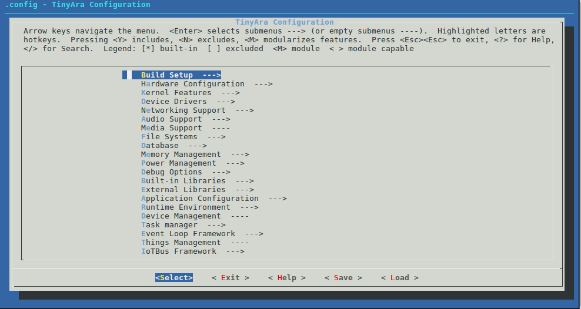

# Manual Setup Build Environment
## Getting the toolchain

Install the OS specific toolchain. Supported OS Type's are "linux" and "mac".  
Get the build in binaries and libraries, [gcc-arm-none-eabi-6-2017-q1-update-*OS Type*.tar.bz2](https://developer.arm.com/open-source/gnu-toolchain/gnu-rm/downloads/6-2017-q1-update)  
Untar the gcc-arm-none-eabi-6-2017-q1-update-*OS Type*.tar.bz2 and export the path like

```bash
	/>  tar xvjf gcc-arm-none-eabi-6-2017-q1-update-[OS Type].tar.bz2
	/>  export PATH=<Your Toolchain PATH>:$PATH
```
Be aware that the recommended toolchain is fully working on 64bits machine.

## Getting the source code
To get the source code git clone to your local machine, move to the TizenRT directory and setup an environment variable
for your TizenRT base directory:

```bash
	/>  git clone https://github.com/Samsung/TizenRT.git
	/>  cd TizenRT
	/>  TIZENRT_BASEDIR="$PWD"
```

## How to Build
To build TizenRT binaries there are 2 steps: 
1) configuring your build for a particular board and configuration set; and 
2) performing the build.

Before you do the configure you will need to know what board and configuration set you would like to use.
To find out the allowed options for board and configuration set use the --help flag when running the configure
shell script like this:
```bash
	/>  ./configure.sh --help
```
This should display all possible attribute you may use e.g. _artik053/hello_


### Step 1 - Configure The Build
Configure the build from the directory *$TIZENRT_BASEDIR/os/tools* 
```bash
	/>  cd os/tools
	/>  ./configure.sh <board>/<configuration_set>
```
e.g.

```bash
	/> cd os/tools
	/> ./configure.sh artik053/hello
        Copy build environment files
        Configuration is Done!
	/>
```

The configuration file is named *defconfig*, and resides under the relative path:
 **\<board\>/\<configuration_set\> ** inside the directory  *build/configs*.  

Hence to see the config file for artik053/hello go to:
	```
		/> cd *$TIZENRT_BASEDIR/build/configs/artik053/hello
		/> ls -l
			total 32
			-rw-r--r-- 1    18754 Sep 20 12:32 defconfig
			-rw-r--r-- 1    6339 Sep 20 12:32 Make.defs
			-rw-r--r-- 1    629 Sep 20 12:32 README.md		
	```

You can do further configuration options to your build using the *make menuconfig* command. This starts the simple
kconfig text based UI, a tool typically used to configure linux kernel builds.
To further modify configuration use  *make menuconfig* from *$TIZENRT_BASEDIR/os*.
```bash
	/>  cd ..
	/>  make menuconfig
```



Refer [kconfig-frontend installation](docs/HowtoInstallKconfigFrontend.md) to use *menuconfig*.


### Step 2 Start A Build
Finally, initiate build by make from *$TIZENRT_BASEDIR/os*.
```bash
	/>  make
```

Built binaries are in *$TIZENRT_BASEDIR/build/output/bin*.

See [Clean commands](HowtoClean.md) to clean built files.  
See [Trouble Shooting](TroubleShooting.md) to resolve any issue on TizenRT usages.

## Configuration Sets

To build a TizenRT application, use the default configuration files named *defconfig* under *build/configs/\<board\>/\<configuration_set\>* folder.  
To customize your application with specific configuration settings, using the menuconfig tool is recommended at *os* folder as shown:
```bash
	/>  make menuconfig
```
Please keep in mind that we are actively working on board configurations, and will be posting our updates on the README files under each config.
