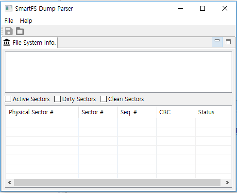

# How to use SmartFS Dump visualizer (SDV)

## What is SDV?

There are three main functions in SmartFS Dump Visualizer (SDV).
1. Display smartfs header contents of all physical sectors.
2. Filter the headers by sector status.
3. Display directory hierarchy of the current smartfs.

## How to run SDV?
To run SDV, please download and install Java to a target PC first.
[Java Download](https://www.oracle.com/technetwork/java/javase/downloads/jdk12-downloads-5295953.html)

SDV can be released for Windows, Linux (Ubuntu), and Mac OS.

After downloading the SDV release (zip/tar.gz) from the following links,
[Windows](../tools/fs/FS_Dump_Parser/Release/SDV_v1.1_20190903_Windows.zip)
[Ubuntu](../tools/fs/FS_Dump_Parser/Release/SDV_v1.1_20190903_Ubuntu.tar.gz)

Decompress the release file and execute SDV.exe/SDV.

## Example of Multi-heap Usage
After starting the tool, an initial screen is shown like below.  

The contents of a smartfs dump file can be shown by opening it through "open" menu.

The following is an example screen when a smartfs dump file is opened.  

