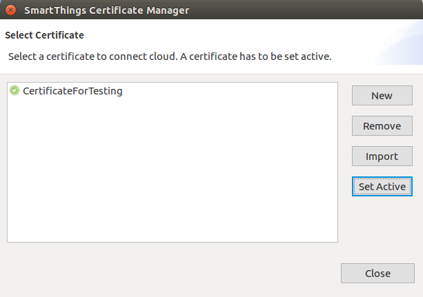
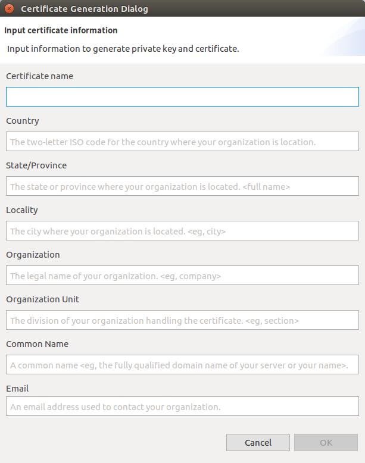
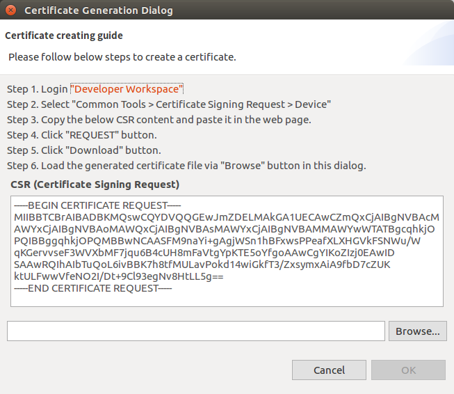
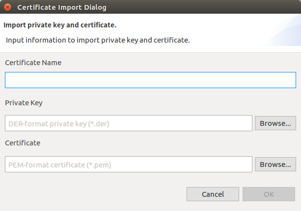

# Managing SmartThings&trade; Certificates

## Dependencies
-   Ubuntu Only

SmartThings&trade; uses OpenSSL for security. To ensure that only trusted developers and manufactures can develop devices that communicate with the SmartThings Cloud, you must get certificates for devices to use the SmartThings&trade; service.

In the Tizen RT IDE, you can perform various certificate-related tasks, such as creation, removal, import, and activation, by using the **SmartThings Certificate Manager**.

**Figure: SmartThings Certificate Manager**

The Certificate Manager is launched automatically if no certificate is set as active when you try to flash a project. To launch the Certificate Manager manually, go to **Tools &gt; ST Certificate Manager** in the Tizen Studio for RT menu.

## Creating a Certificate

The process of creating a new certificate requires you to generate a Certificate Signing Request (CSR) and submit it to the [Developer Workspace](https://devworkspace.developer.samsung.com/smartthingsconsole/iotweb/site/index.html#/main) Web site.

To create a new certificate to use the SmartThings&trade; service:

1.  In the SmartThings Certificate Manager, click **New**.
2. In the Certificate Generation Dialog, enter the required information to generate a certificate and click **OK**:

    -   **Certificate name**: Unique name for the certificate
    -   **Country**: Two-letter ISO code for the country where your organization is located
    -   **State/Province**: State or province where your organization is located
    -   **Locality**: City where your organization is located
    -   **Organization**: Legal name of your organization
    -   **Organization Unit**: Division of your organization handling the certificate
    -   **Common Name**: Fully-qualified domain name of your server or your name
    -   **Email**: Email address used to contact your organization

    

3. Download the certificate file and enter it in the Certificate Manager:

    -  Log in to the [Developer Workspace](https://devworkspace.developer.samsung.com/smartthingsconsole/iotweb/site/index.html#/main) Web site.
    -  In your Web browser, select **Common Tools &gt; Certificate Signing Request &gt; Device**.
    -  In the Certificate Generation Dialog, copy the content of the **CSR (Certificate Signing Request)** field to the clipboard.
    -  In your Web browser, paste the copied content into the **CSR** field and click **Request**. The certificate is generated in the **Certificate** field.
    -  Click **Download** and specify a location where the certificate file is saved.
    -  In the Certificate Generation Dialog, click **Browse**, select the downloaded certificate file, and click **OK**.

    

## Importing a Certificate

To import an existing certificate:
1.  In the SmartThings Certificate Manager, click **Import**.
2. In the Certificate Import Dialog, enter the required information to import a certificate and click **OK**:

    -   **Certificate Name**: Unique name for the certificate
    -   **Private Key**: Private key file in the `.der` format
    -   **Certificate**: Certificate file in the `.pem` format

    

## Activating a Certificate

To flash a project, you must have an active certificate. The Tizen RT IDE copies the activated certificate to the project during the flashing process.

To activate a certificate:

1.  In the SmartThings Certificate Manager, select the certificate you want to activate.
2.  Click **Set Active**.
